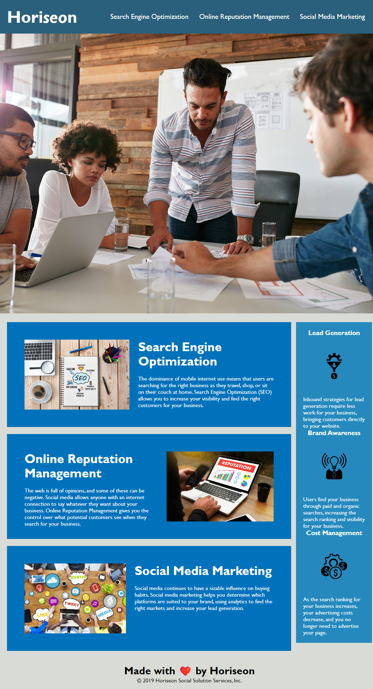

## ⭐ Horiseon Upgrade! ⭐

## Description ✏️

I was given a challenge to make some improvements to a webpage. I changed some of the HTML5, added alt tags, and other changes to make the web page better than it was before.

## Installation 🔑

There weren't any installations with this project.

## Usage 🎯

This challenge demonstrated what I could do with some improvements to the html and CSS.

## Screenshot 🎯

## Credits 👈

Credit for this project is given to notes from class, the w3Schools website, and help from a Bootcamp tutor, as needed.

## License 📝

NA
